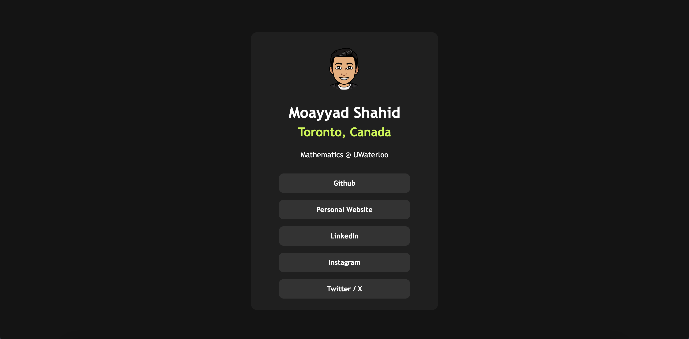

# Social Links Profile

A brief front-end focused project with links to various social platforms I'm on.

## Table of contents

- [Social Links Profile](#social-links-profile)
  - [Table of contents](#table-of-contents)
    - [Screenshot](#screenshot)
    - [The Objective](#the-objective)
    - [Links](#links)
  - [My process](#my-process)
    - [Built with](#built-with)
    - [What I learned](#what-i-learned)
    - [Continued development](#continued-development)

### Screenshot

### The Objective

Users should be able to:

- See hover and focus states for all interactive elements on the page.
- View the optimal layout for the site depending on their device's screen size.
- Access social media links directly by clicking on the respective buttons.

### Links

- Solution URL: [https://github.com/MoayyadShahid/Social-Links-Profile](https://github.com/MoayyadShahid/Social-Links-Profile)
- Live Site URL: [https://moayyadshahid.github.io/Social-Links-Profile/](https://moayyadshahid.github.io/Social-Links-Profile/)

## My process

### Built with

- HTML5
- CSS3
- Flexbox
- Responsive Design

### What I learned

In this project, I enhanced my understanding of responsive web design and the importance of accessibility in web applications. 

### Continued development

In future projects, I am eager to explore more advanced CSS techniques, such as animations and transitions to enhance interactivity. 